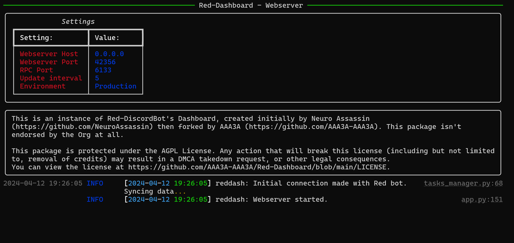

.. important::

    Many thanks to Neuro for the initial project and for this detailed documentation!

Running the Webserver
=====================

.. important::

    In order for the bot to communicate with the webserver, you must add the argument ``--rpc`` to the start line of your Red bot.

At this point, the Dashboard cog should be loaded and initialized on your Red bot, and restarted to have RPC enabled (as mentioned above).
The webserver package should be installed into it's own, separate virtual environment, and your OAuth2 settings should be updated within Discord.

Once you are squared away, activate your virtual environment using the command during installation, then run:

.. prompt:: bash

   reddash

A text interface should pop up, similar to that below:

If your screen looks like the above, congrats! Your dashboard should be successfully connected to your Red bot, and viewable at the domain/IP address specified in `Configuration Companion Cog - Single Bot <../configuration_guides/singlebot>`. If you wish for the webserver to run with Automatic Startup, check out the `Automatic Startup (systemctl) <../installation_guides/systemctl_startup>` guide if you are on Linux.

Be aware that if your bot is switched off, if RPC is not enabled (`--rpc` cli flag on your bot) or is configured with the wrong port, or if the cog Dashboard is unloaded, the Webserver will not start and will wait for a first connection. If you have any other issues, feel free to drop by the support server listed `here <../help_and_support>`.